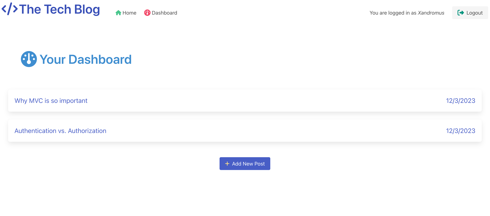
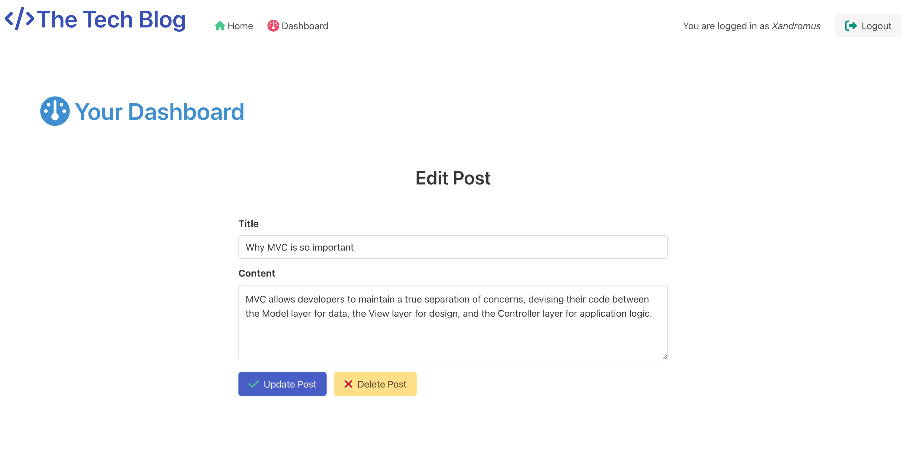

# Tech Blog

## Description

The Tech Blog is a CMS-style blog site built using the Model-View-Controller paradigm and is intended to be used by developers who love coding and love talking about coding.
Share advice, voice concerns, and display your interest in the myriad of technological topics that surround developers today.

## Table of Contents
- [Installation](#installation)
- [Requirements](#requirements)
- [Usage](#usage)
- [License](#license)
- [Questions](#questions)
- [Screenshots](#screenshots)

## Installation

No installation needed.

## Requirements

Any Web Browser

## Usage

To join in on The Tech Blog, visit the link that is provided below, and you are able to view the homepage without an account.
It will display the current blogs that have been written on the site, and after signing up using the Sign Up link, you will be able to
create your own posts when visiting your dashboard and also comment on other posts.

## License

This application is covered under MIT License.

Please refer to the LICENSE file in repo for more information.

## Questions

My GitHub profile: https://github.com/jaredbartos

If you have any further questions, please contact me through email.

jaredbartos@gmail.com

## Screenshots

